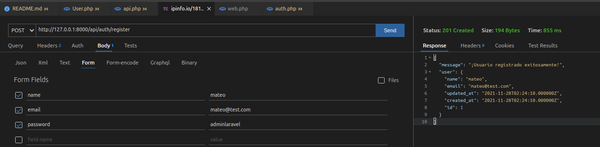
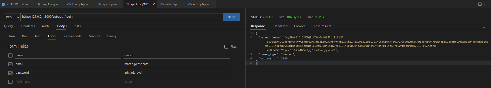
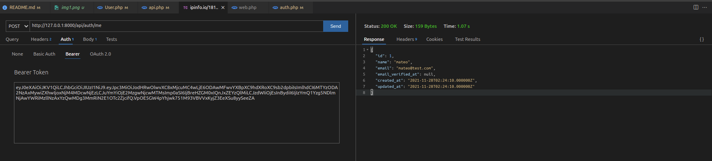

<p align="center"><a href="https://laravel.com" target="_blank"></a></p>

<p align="center">
<a href="https://travis-ci.org/laravel/framework"></a>
<a href="https://packagist.org/packages/laravel/framework"></a>
<a href="https://packagist.org/packages/laravel/framework"></a>
<a href="https://packagist.org/packages/laravel/framework"></a>
</p>

## API Rest - Login/Register JWT - CRUD Operations


- https://jwt-auth.readthedocs.io/en/develop/laravel-installation/
- https://jwt-auth.readthedocs.io/en/develop/quick-start/

## Install jwt-auth into laravel project
- composer require tymon/jwt-auth

## Add service provider ( Laravel 5.4 or below )


-Add the service provider to the providers array in the config/app.php config file as follows:


```php
'providers' => [

    ...

    Tymon\JWTAuth\Providers\LaravelServiceProvider::class,
]
```

-php artisan vendor:publish --provider="Tymon\JWTAuth\Providers\LaravelServiceProvider"

-php artisan jwt:secret

-go to conf/auth.php , change the file with:

```php
'defaults' => [
        //'guard' => 'web', //change by 'guard' => 'api'
        
        'guard' => 'api',
        'passwords' => 'users',
    ],

'guards' => [
        'web' => [
            'driver' => 'session',
            'provider' => 'users',
        ],

        'api' => [
            'driver' => 'jwt',
            'provider' => 'users',
            'hash' => false,
        ],
    ],

```


-go to app/Models/user.php , change the file with:
```php
    use Tymon\JWTAuth\Contracts\JWTSubject; //add

    class User extends Authenticatable implements JWTSubject //change this

    add into the class User --  getJWT  methods
    {

        /**
         * Get the identifier that will be stored in the subject claim of the JWT.
         *
         * @return mixed
         */
        public function getJWTIdentifier()
        {
            return $this->getKey();
        }

        /**
         * Return a key value array, containing any custom claims to be added to the JWT.
         *
         * @return array
         */
        public function getJWTCustomClaims()
        {
            return [];
        }
    }

```

-go to routes/api.php and add:

```php
Route::group([

    'middleware' => 'api',
    'prefix' => 'auth'

], function ($router) {

    Route::post('login', [AuthController::class, 'login']);  
    Route::post('logout', [AuthController::class, 'logout']);
    Route::post('refresh', [AuthController::class, 'refresh']);
    Route::post('me', [AuthController::class, 'me']);
    Route::post('register', [AuthController::class, 'register']);

});
```


-php artisan make:controller AuthController


go to app/http/controllers and add:

```php
    <?php

namespace App\Http\Controllers;

use Illuminate\Support\Facades\Auth;
use App\Http\Controllers\Controller;

use Illuminate\Http\Request;
use Illuminate\Support\Facades\Validator;
use App\Models\User;

class AuthController extends Controller
{
    /**
     * Create a new AuthController instance.
     *
     * @return void
     */
    public function __construct()
    {
        $this->middleware('auth:api', ['except' => ['login','register']]);
    }

    /**
     * Get a JWT via given credentials.
     *
     * @return \Illuminate\Http\JsonResponse
     */
    public function login()
    {
        $credentials = request(['email', 'password']);

        if (! $token = auth()->attempt($credentials)) {
            return response()->json(['error' => 'Unauthorized'], 401);
        }

        return $this->respondWithToken($token);
    }

    /**
     * Get the authenticated User.
     *
     * @return \Illuminate\Http\JsonResponse
     */
    public function me()
    {
        return response()->json(auth()->user());
    }

    /**
     * Log the user out (Invalidate the token).
     *
     * @return \Illuminate\Http\JsonResponse
     */
    public function logout()
    {
        auth()->logout();

        return response()->json(['message' => 'Successfully logged out']);
    }

    /**
     * Refresh a token.
     *
     * @return \Illuminate\Http\JsonResponse
     */
    public function refresh()
    {
        return $this->respondWithToken(auth()->refresh());
    }

    /**
     * Get the token array structure.
     *
     * @param  string $token
     *
     * @return \Illuminate\Http\JsonResponse
     */
    protected function respondWithToken($token)
    {
        return response()->json([
            'access_token' => $token,
            'token_type' => 'bearer',
            'expires_in' => auth()->factory()->getTTL() * 60
        ]);
    }


    public function register(Request $request)
    {
        $validator = Validator::make($request->all(), [
            'name' => 'required',
            'email' => 'required|string|email|max:100|unique:users',
            'password' => 'required|string|min:6',
        ]);
        if($validator->fails()){
            return response()->json($validator->errors()->toJson(),400);
        }

        $user = User::create(array_merge(
            $validator->validate(),
            ['password' => bcrypt($request->password)]
        ));

        return response()->json([
            'message' => '¡Usuario registrado exitosamente!',
            'user' => $user
        ], 201);
    }
}
```


## Test API Login and Register 

- Register


- Login and get token in response


- Post token to access and get the current user



